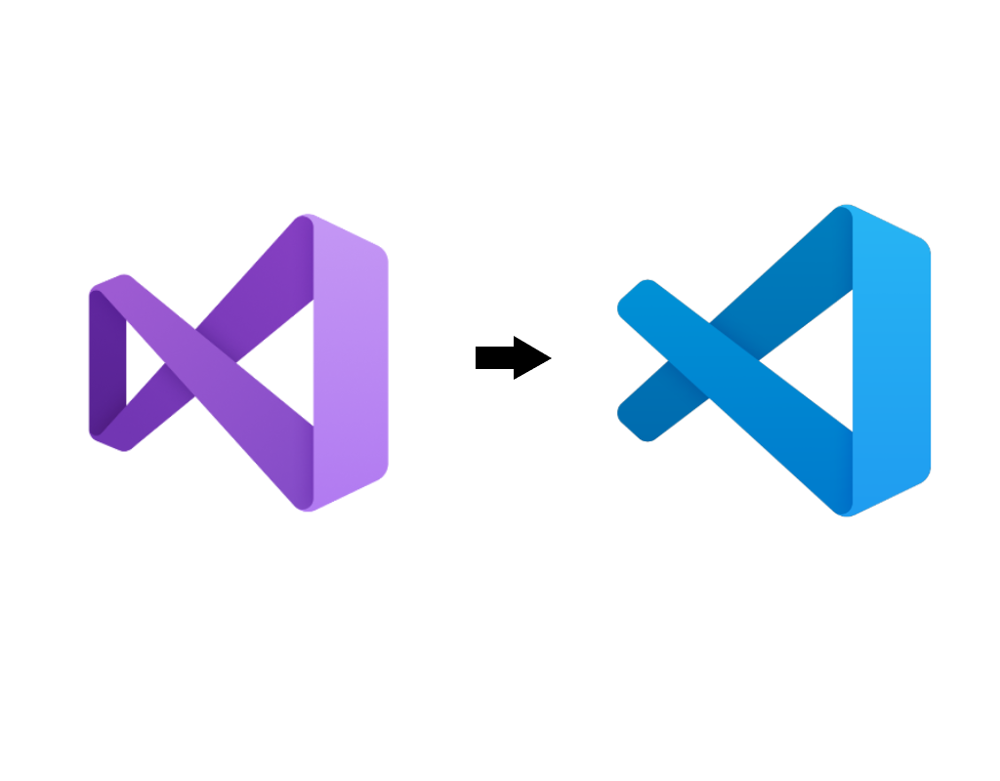
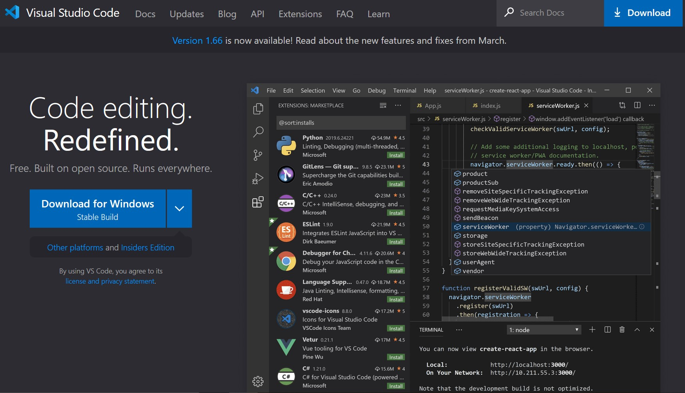
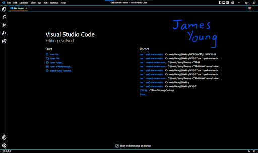
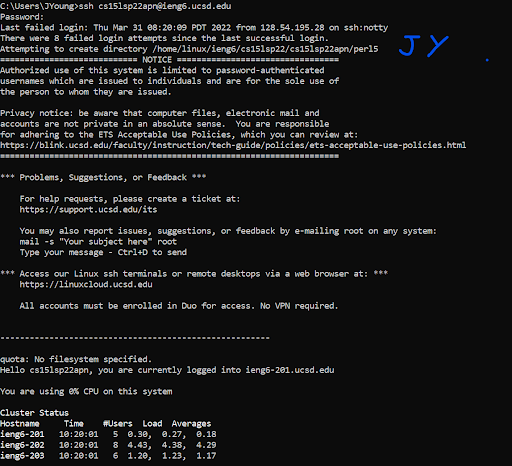
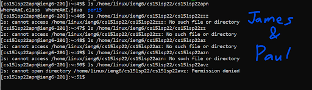
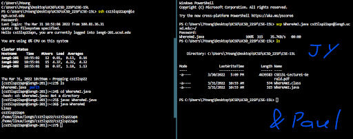
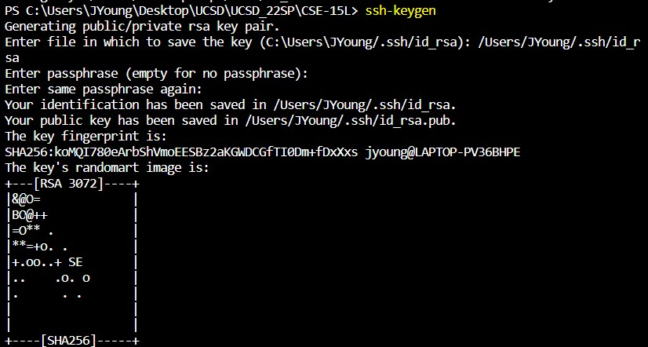
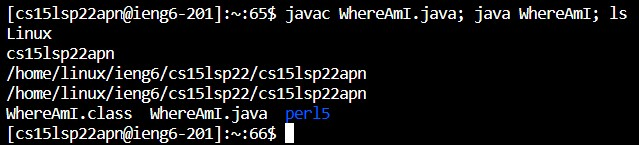

# Week 2 Lab Report
## Guide for logging into a course-specific account on _ieng6_

Note: This guide is intended for Windows computers.

- Installing VScode
- Remotely Connecting
- Trying Some Commands
- Moving Files with scp
- Setting an SSH Key
- Optimizing Remote Running


---
# Installing Visual Studio Code

Head to the [__Visual Studio Code__](https://code.visualstudio.com/) website to download and install it. Follow the link and be sure not to mistakenly install _Microsoft Visual Studio_ (without _"Code"_ at the end of the name) instead.

We want the blue one


The download page


It should look like something this after installation (dark theme enabled)



---
# Remotely Connecting

### Install the program [__OpenSSh__](https://docs.microsoft.com/en-us/windows-server/administration/openssh/openssh_install_firstuse).
Learn more about SSH (Secure Shell Protocol) on [Wikipedia](https://en.wikipedia.org/wiki/Secure_Shell).

### Find your course-specific account with the [UCSD Account Lookup Tool](https://sdacs.ucsd.edu/~icc/index.php).

### Return to Visual Studio Code and open a terminal. Input the following command (with '%f' replaced by the quarter, year, and account):

> `ssh cs15l%f@ieng6.ucsd.edu`

An example account could be cs15lsp22zz@ieng6.ucsd.edu with 'sp' for Spring quarter, '22' for the year 2022, and 'zz' for the account name. Quarter abbreviations are as follows: Fall = fa, Winter = wi, Spring = sp, Summer = su.

- If you are connecting for the first time, you will see the following prompt to which you should respond with yes:

````
The authenticity of host 'ieng6.ucsd.edu (128.54.70.227)' can't be established.

RSA key fingerprint is SHA256:ksruYwhnYH+sySHnHAtLUHngrPEyZTDl/1x99wUQcec.

Are you sure you want to continue connecting (yes/no/[fingerprint])?
````

- Input your password and your computer (the client) should now be connected to the server



Additonal instructions on connecting to a remote host available on the [VS Code Website](https://code.visualstudio.com/docs/remote/ssh#_connect-to-a-remote-host).


---
# Trying Some Commands

There are many commands available, including `cd`, `ls`, `pwd`, `mkdir`, and `cp` among others. The example in the screenshot is from lab 1 and shows the command -ls, which lists all the files in a directory. The first four attempts failed because I was trying to access directories that do not exist. The fifth and last attempt failed because I was trying to access a directory that belongs to someone else. By default, we do not have access to the files of others.




---
# Moving Files with SCP

The following image shows the split-screen funstion in VScode. On the left is the server whereas the right is the client. In the client, the command scp made a copy of the file _WhereAmI.java_ from the client to the server. Following after, on the left I input `cd WhereAmI.java`, which ran the file locally on the server to prove it is indeed saved there.




---
# Setting an SSH Key

The program, _SSH-keygen_, creates a pair of files, one private stored in the client and one public in the server. This pair of files can be used in place of a password. Follow this example walkthrough:

- Replace 'JYoung' with the username on your computer
- Leave the passphrase empty



## Extra steps for Windows devices:
[Instructions from Microsoft](https://docs.microsoft.com/en-us/windows-server/administration/openssh/openssh_keymanagement#user-key-generation)
.jpg)

.jpg)


---
# Optimizing Remote Running

There are many methods to reduce time needed for tasks. For example, the up and down arrows cycle through previous inputs. Additionally, one can use semicolons to run multiple commands on one line.

Try `javac WhereAmI.java; java WhereAmI; ls`

The first command compiled the java file. The second ran it. And the third displayed the content of the folder.



---
# Other Resources:
[Lab 1 Instructions Writeup](https://docs.google.com/document/d/1ZJsxrCRiXRbgBpAxhTRwIIqs2-xILh4EZEXfhyADS7I/edit) (this assignment)

[CSE 15L Lecture Slides week 1](https://docs.google.com/presentation/d/1M1usJWoXlajH29ONzpQ7L2BxeHMdL3C7sMUSBtogpOw/edit#slide=id.g9aaf8b0d81_0_25)
(Spring 2022 with Professor Gerald Soosai Raj)

Lab Group Google Docs with TA Jessica Lam (requires permission to access):

[Lab Week 1](https://docs.google.com/document/d/1bWz30m_V0ENEkdCKICzX2L37mdhOCcbEqrSbeqsJ2QA/edit#heading=h.s8u88f6kqofr) (2022.03.31);
[Lab Week 2](https://docs.google.com/document/d/1EMxWD-WkNZeto2HrgJhavFGu7xCwQafZ3rzX2057TDY/edit#) (2022.04.07)
