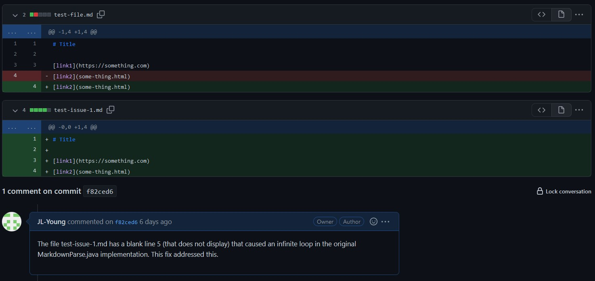
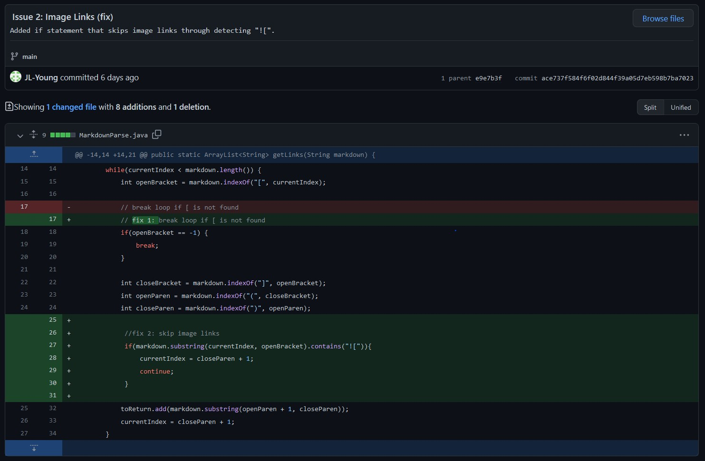

# Lab Report 2 - Week 4
---
## Code Change 1: 

[Commit 1](https://github.com/JL-Young/markdown-parser/commit/f82ced60bc55f85450cab3ff2955879f63c26885)

[file (of change 1)](lab-report-2/test-issue-1.md) with failure-inducing input

### Symptom as shown in VSCode terminal:

### Description:

The original program finished running only when the _currentIndex_ variable was greater than or equal to the _length_ of the file. This is an oversight: should the last link in the file not be at the end of said file, the program would continue to search the file for additional links. In cases with files that do not end with a link, the program would continue searching until resulting in an error as no more linke exist to be found.

---

## Code Change 2

[Commit 2](https://github.com/JL-Young/markdown-parser/commit/ace737f584f6f02d844f39a05d7eb598b7ba7023)

[file (of change 2)](lab-report-2/test-2) with failure-inducing input

### Symptom as shown in VSCode terminal:

### Description:
As seen in the output above (symptom image), the second _"link"_ is actually an image file and not a website. The original program did not account for images in the file, which are written in a similar way to links when writing in markdown. As images are not part of the desired outputs, returning an image is incorrect behavior for the program.

---

## Code Change 3
[Commit 3]()

[file (of change 3)]()

### Symptom as shown in VSCode terminal:

### Description: