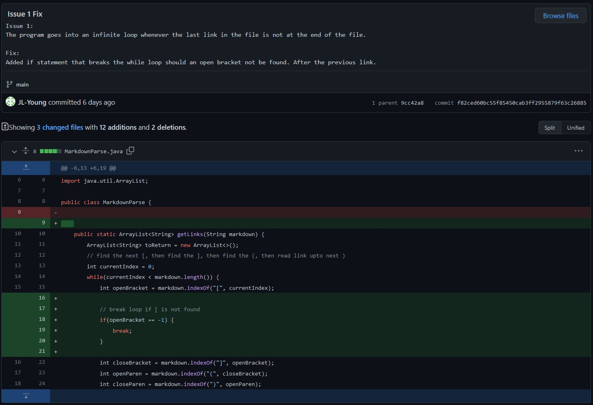
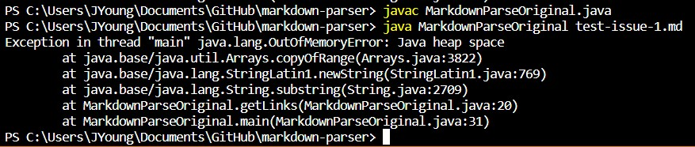
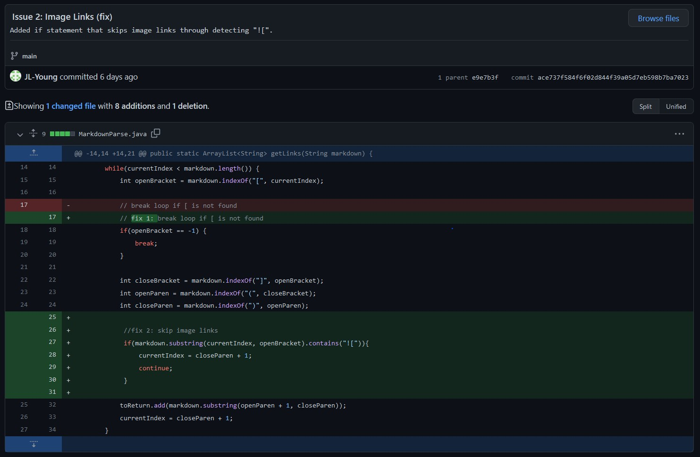
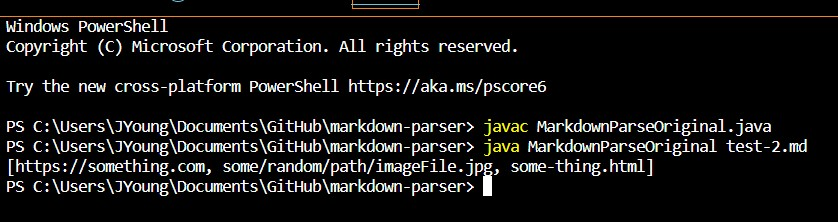
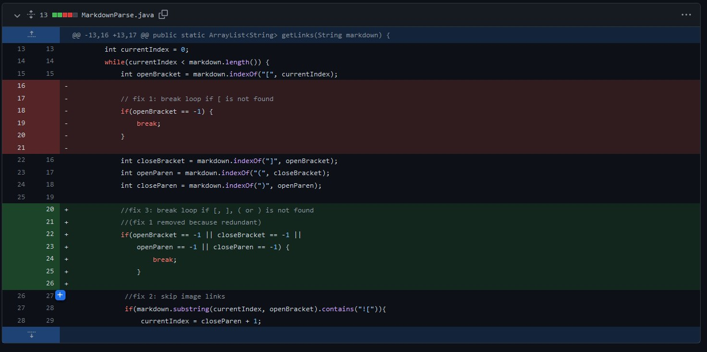
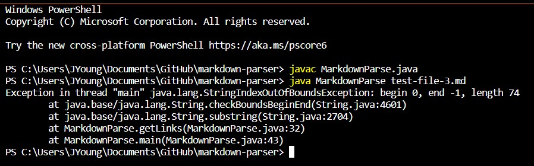

# Lab Report 2 - Week 4
---
## Code Change 1: 

[Commit 1](https://github.com/JL-Young/markdown-parser/commit/f82ced60bc55f85450cab3ff2955879f63c26885)

[file (of change 1)](https://jl-young.github.io/cse15l-lab-reports/lab-report-2/test-issue-1.md) with failure-inducing input

### Symptom as shown in VSCode terminal:

### Description:

The original program finished running only when the _currentIndex_ variable was greater than or equal to the _length_ of the file. This is an oversight: In cases with files that do not end with a link, the program would continue searching when no more links exist to be found. Symbols not found will be assigned index -1. Later on, the subString method call would fail because -1 is out of bounds for it.

---

## Code Change 2

[Commit 2](https://github.com/JL-Young/markdown-parser/commit/ace737f584f6f02d844f39a05d7eb598b7ba7023)

[file (of change 2)](https://jl-young.github.io/cse15l-lab-reports/lab-report-2/test-2.md) with failure-inducing input

### Symptom as shown in VSCode terminal:

### Description:
As seen in the output above (symptom image), the second _"link"_ is actually an image file and not a website. The original program did not account for images in the file, which are written in a similar way to links in markdown. As images are not part of the desired outputs, returning an image is incorrect behavior for the program.

---

## Code Change 3
[Commit 3]()

[file (of change 3)](https://jl-young.github.io/cse15l-lab-reports/lab-report-2/test-file-3.md)

### Symptom as shown in VSCode terminal:

### Description:
Brackets and parrentheses may not always come in pairs whereas the program was implemented assuming these symbols did. Because of this oversight, when the file contains, for example a lone open parenthesis "(", the index of the end parenthesis ")" would be -1 as it is not found. Later on, the subString method call would fail because -1 is out of bounds for it.