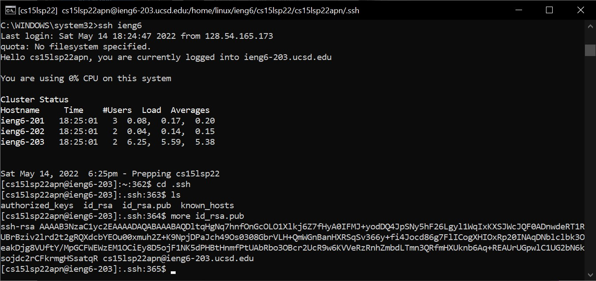
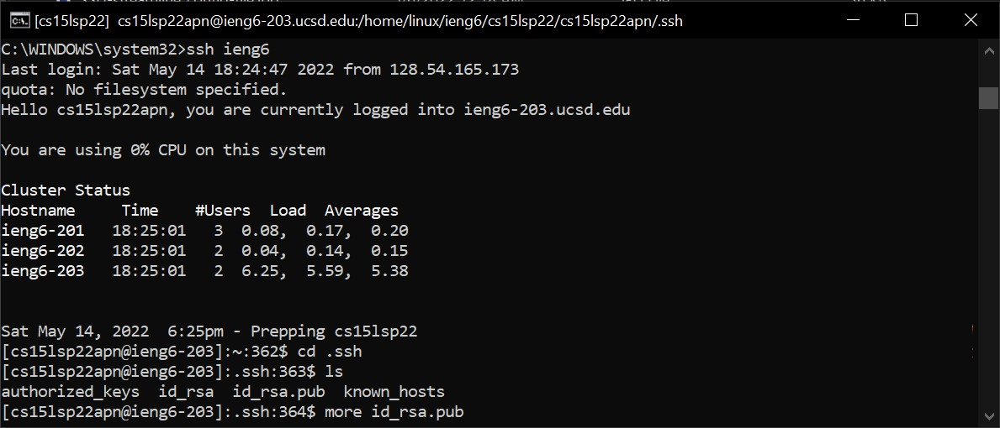
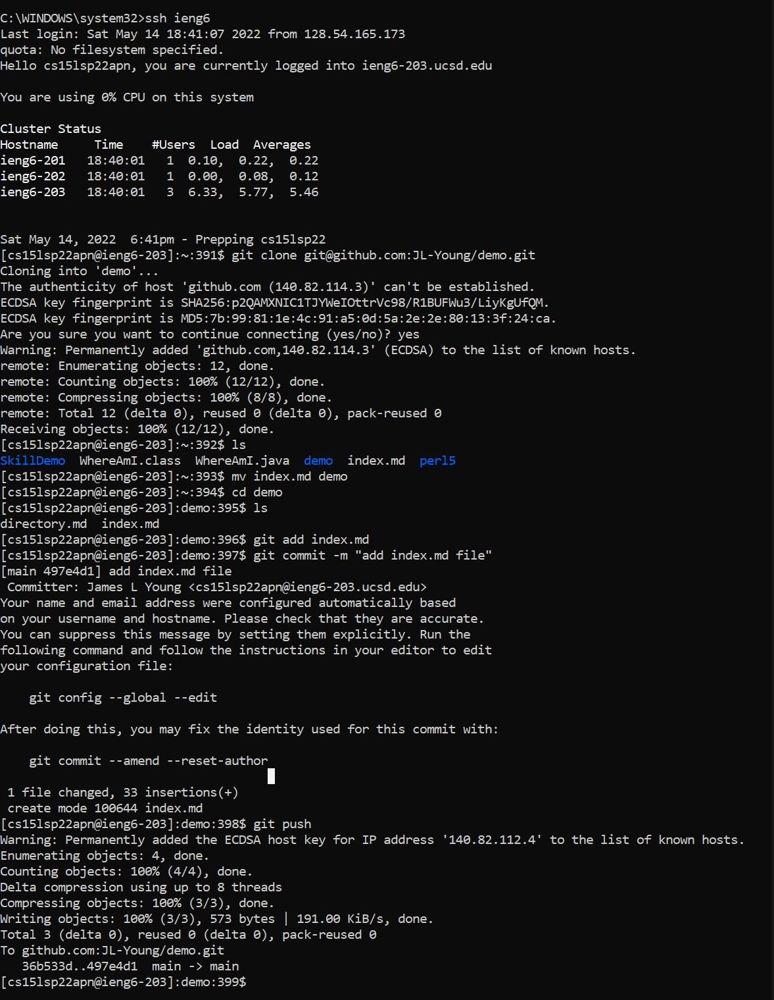
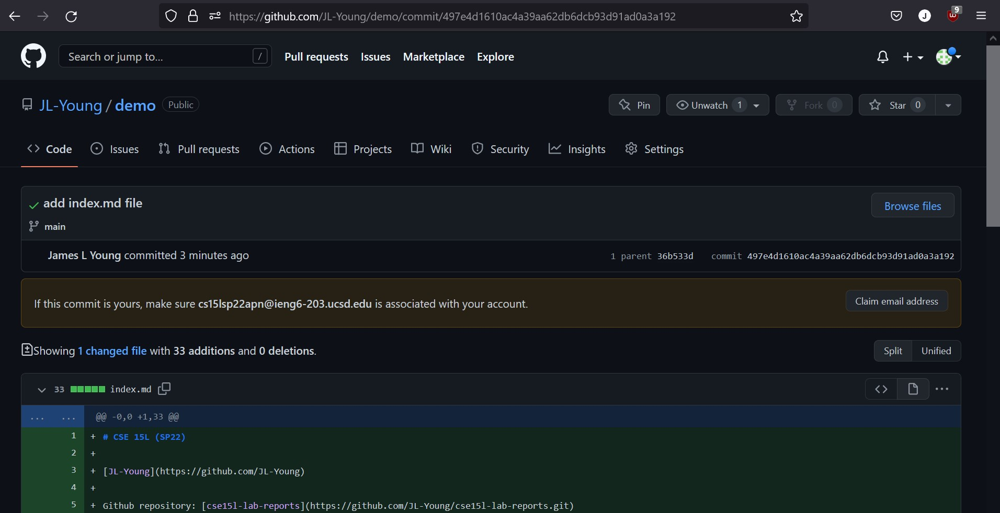
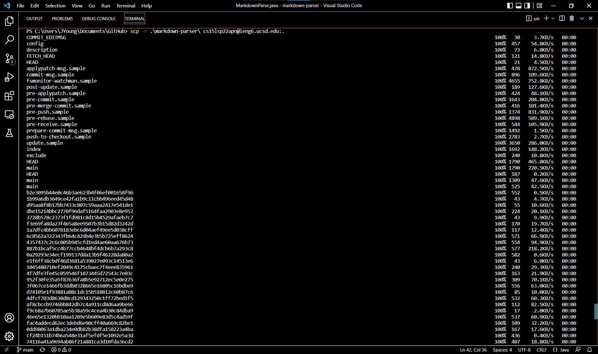
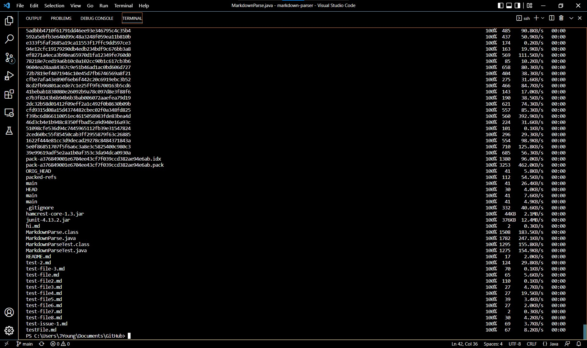
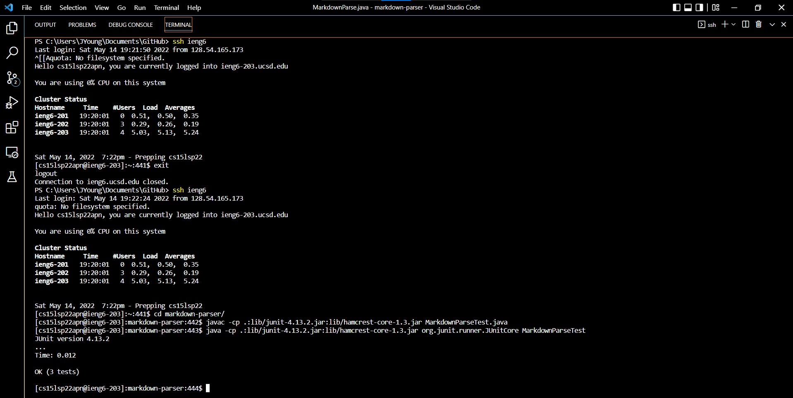
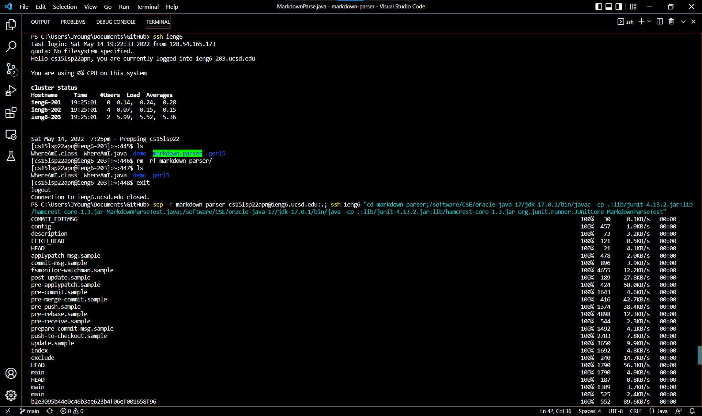
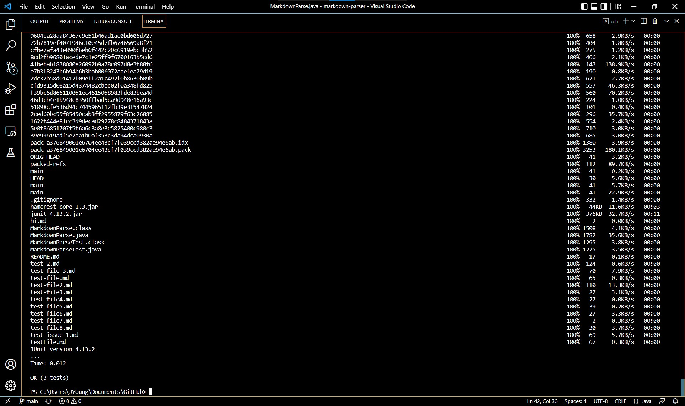

# Lab Report 3 - Week 6

Return to [index](https://jl-young.github.io/cse15l-lab-reports/)

---
## Streamlining SSH Configuration

- edit .ssh/config file through VSCode

`~/.ssh/config`


- log in to account using alias

`ssh <user>`


- copy file to account using alias

`scp <file> <user>`


---
## Setup Github Access from ieng6

- public key location on Github

[Github > Settings > Keys](https://github.com/settings/keys)


- public key location on ieng6 server

```
ssh <user> 
cd .ssh
more id_rsa.pub
```



- private key location

`ssh <user> "cd .ssh; ls"` (private key is file id_rsa)



- git commands to commit and push a change to Github from ieng6 account

```
ssh <user>
git clone <repository SSH link>
\\ make changes (e.g. mv <file>)
\\ perform following commands within cloned repository
git add <changed file>
git commit -m "<write commit comment>"
git push
```



[link to commit](https://github.com/JL-Young/demo/commit/497e4d1610ac4a39aa62db6dcb93d91ad0a3a192)



---
## Copy Whole Directories with `scp -r`

- copy markdown-parse directory to ieng6

`scp -r <directory> <user@server>:.` 
(:. specifies home directory)





- log in, compile, and run markdown-parse tests on ieng6

```
ssh <user>
javac -cp .:lib/junit-4.13.2.jar:lib/hamcrest-core-1.3.jar MarkdownParseTest.java
java -cp .:lib/junit-4.13.2.jar:lib/hamcrest-core-1.3.jar org.junit.runner.JUnitCore MarkdownParseTest
```
(Linux commands)



- copy markdown-parse, and compile and run tests on ieng6 in one line

```
scp -r markdown-parser cs15lsp22<3-letter ID>@ieng6.ucsd.edu:.; ssh <user> "cd markdown-parser;/software/CSE/oracle-java-17/jdk-17.0.1/bin/javac -cp .:lib/junit-4.13.2.jar:lib/hamcrest-core-1.3.jar MarkdownParseTest.java;/software/CSE/oracle-java-17/jdk-17.0.1/bin/java -cp .:lib/junit-4.13.2.jar:lib/hamcrest-core-1.3.jar org.junit.runner.JUnitCore MarkdownParseTest"
```



