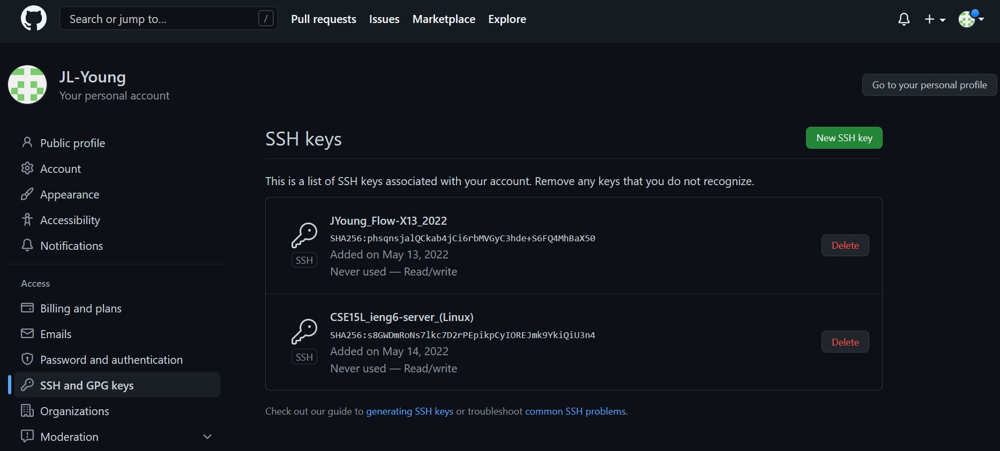
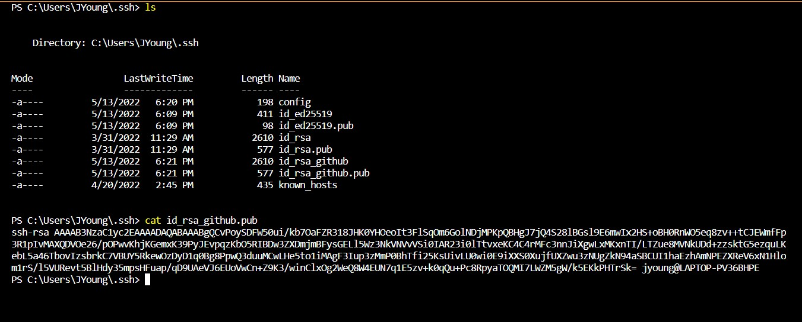
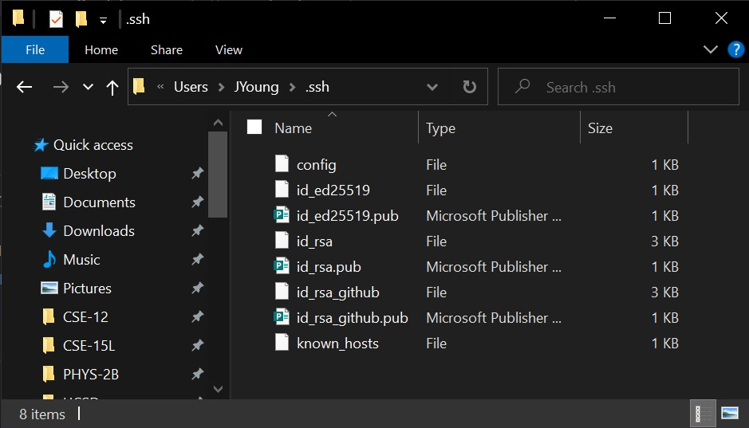

# Lab Report 3 - Week 6

---
## Streamlining SSH Configuration

- editing .ssh/config file through VSCode

- logging in to account using alias

- copying file to account using alias

---
## Setup Github Access from ieng6

- public key location on Github

- public key loaction on laptop

- private key location

-

-

(copy SSH public key on ieng6 server:

[piazza_cse15l@519](https://piazza.com/class/l0lgl3r7ph370k?cid=519))

` ~/.ssh/authorized_keys `

---
## Copy Whole Directories with SCP

-

-

-

