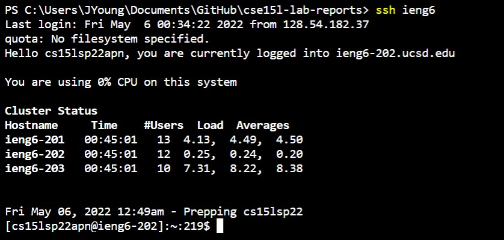
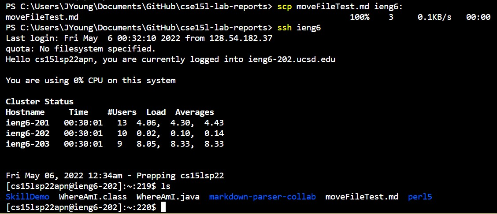

# Lab Report 3 - Week 6

---
## Streamlining SSH Configuration

- editing .ssh/config file through VSCode

- logging in to account using alias

- copying file to account using alias

---
## Setup Github Access from ieng6

-

-

-

-

---
## Copy Whole Directories with SCP

-

-

-

