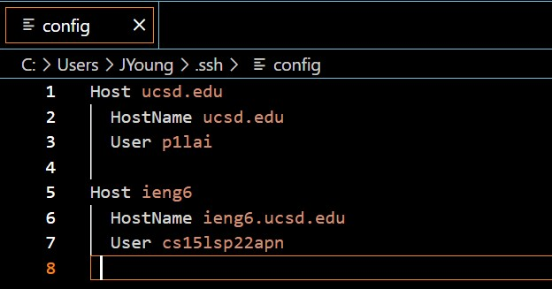

# Lab Report 3 - Week 6

Return to [index](https://jl-young.github.io/cse15l-lab-reports/)

---
## Streamlining SSH Configuration

- editing .ssh/config file through VSCode

- logging in to account using alias

- copying file to account using alias

---
## Setup Github Access from ieng6

- public key location on Github

- public key loaction on ieng6 server

- private key location

- git commands to commit and push a change to Github from ieng6 account

[link to commit](https://github.com/JL-Young/demo/commit/497e4d1610ac4a39aa62db6dcb93d91ad0a3a192)

---
## Copy Whole Directories with SCP

-

-

-

