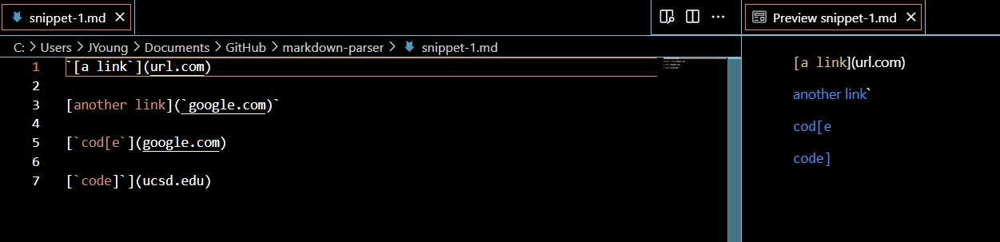
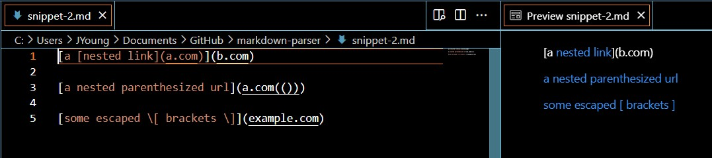
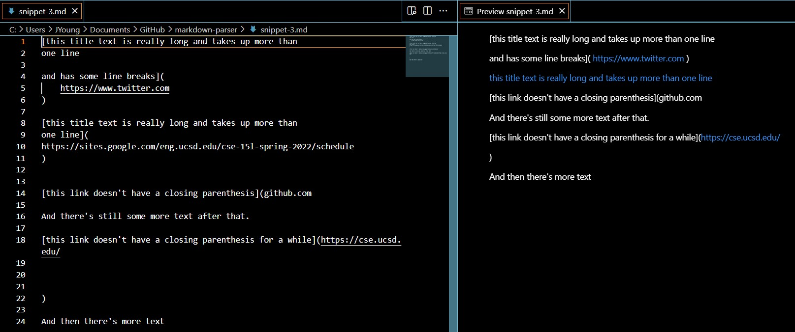
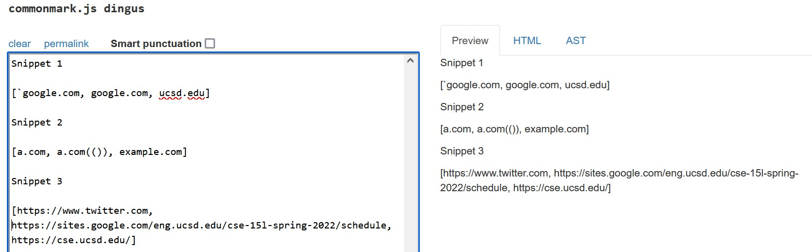
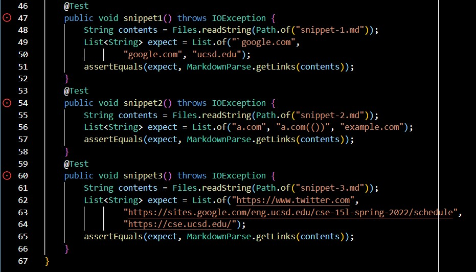
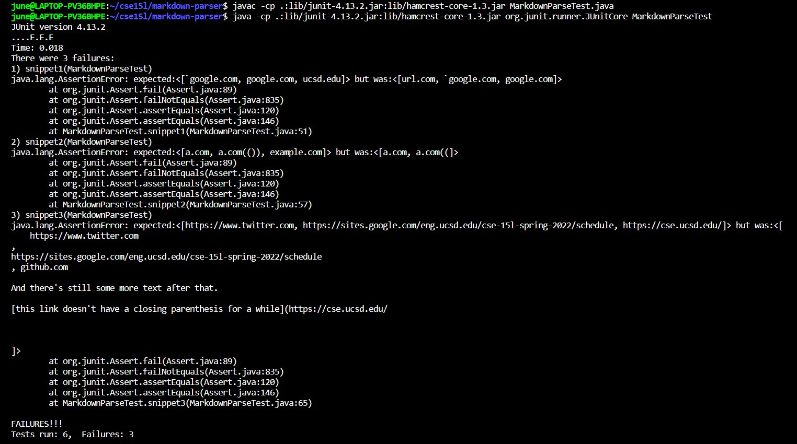
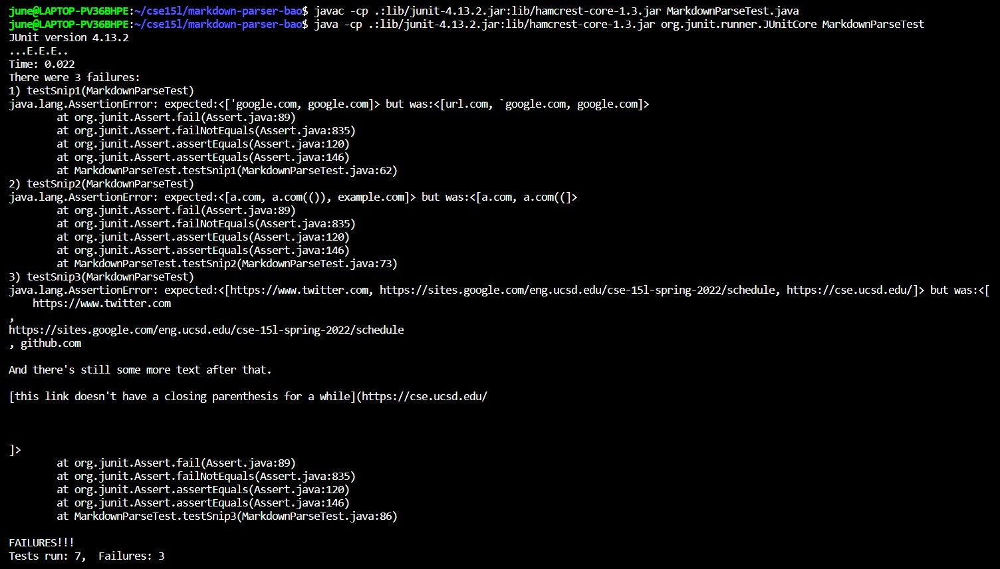

# Week 4 Lab Report

[JL-Young](https://github.com/JL-Young)

Return to [index](https://jl-young.github.io/cse15l-lab-reports/)

---
## MarkdownParse Repositories

Author: [JL-Young](https://github.com/JL-Young/markdown-parser) (Young)

Reviewed: [cynthia-bao](https://github.com/cynthia-bao/markdown-parser) (Bao)

---
## Snippet Previews, Expected Outputs, and Tests

- Snippet Previews (VSCode)

- Expected Output ([Commonmark](https://spec.commonmark.org/dingus/))

- MarkdownParseTest.java: tests for snippets

- Test failures (Young)

- Test failures (Bao)

---
## Answers to Questions

__Do you think there is a small (<10 lines) code change that will make your program work for snippet 1 and all related cases that use inline code with backticks? If yes, describe the code change. If not, describe why it would be a more involved change.__

- My answer to q1

__Do you think there is a small (<10 lines) code change that will make your program work for snippet 2 and all related cases that nest parentheses, brackets, and escaped brackets? If yes, describe the code change. If not, describe why it would be a more involved change.__

- My answer to q2

__Do you think there is a small (<10 lines) code change that will make your program work for snippet 3 and all related cases that have newlines in brackets and parentheses? If yes, describe the code change. If not, describe why it would be a more involved change.__

- My answer to q3

__If your code already works on some/all test cases, include an explanation of what were the code changes that allowed the tests to pass.__

- n/a: all three tests failed
