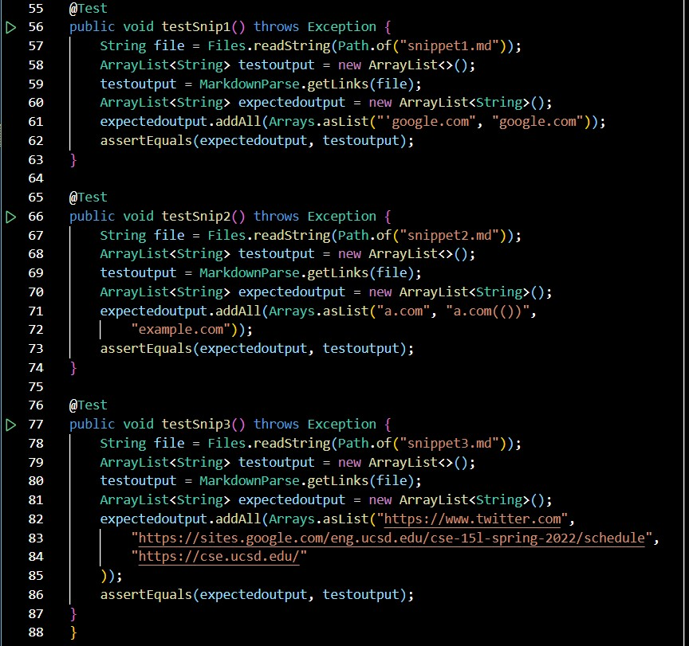

# Lab Report 4 - Week 8

[JL-Young](https://github.com/JL-Young)

Return to [index](https://jl-young.github.io/cse15l-lab-reports/)

---
## MarkdownParse Repositories

Author: [JL-Young](https://github.com/JL-Young/markdown-parser) (Young)

Reviewed: [cynthia-bao](https://github.com/cynthia-bao/markdown-parser) (Bao)

---
## Snippet Previews, Expected Outputs, and Tests

- Snippet Previews (VScode)

- Expected Outputs ([Commonmark](https://spec.commonmark.org/dingus/))

- MarkdownParseTest.java: tests for snippets (Young)

- MarkdownParseTest.java: tests for snippets (Bao)

- JUnit Test Output Failures (Young)

- JUnit Test Output Failures (Bao)

---
## Answers to Questions: Possible Code Changes to Pass Tests

__Do you think there is a small (<10 lines) code change that will make your program work for snippet 1 and all related cases that use inline code with backticks? If yes, describe the code change. If not, describe why it would be a more involved change.__

- A possible solution is for _MarkdownParse.java_ to ignore characters between two backticks or from a backtick to a line break. This will skip the unwanted open bracket at the start of line 1 and not consider _url.com_ a link. This will also skip the unwanted end bracket in line 7, allowing the second and correct endbracket to be recognized and for _ucsd.edu_ to be included in the output.

__Do you think there is a small (<10 lines) code change that will make your program work for snippet 2 and all related cases that nest parentheses, brackets, and escaped brackets? If yes, describe the code change. If not, describe why it would be a more involved change.__

- I have not thought of a way to recognise _a.com(())_ properly, but a possible solution for _example.com_ would be to search for "](" in the file instead of end bracket and open parenthesis separately. This will skip the unwanted end bracket in line 5, allowing for the "](" to be recognized and for _example.com_ to be included in the output.

__Do you think there is a small (<10 lines) code change that will make your program work for snippet 3 and all related cases that have newlines in brackets and parentheses? If yes, describe the code change. If not, describe why it would be a more involved change.__

- First, _MarkdownParse.java_ can break any iteration should both text and a line break be found between the open and close parenthesis. This change would skip _github_, but not _twitter_, and include _cse.ucsd.edu_. Second, _MarkdownParse.java_ can omit line breaks from being returned so that _twitter_ and _cse.ucsd.edu_ are included in the output properly.

__If your code already works on some/all test cases, include an explanation of what were the code changes that allowed the tests to pass.__

- n/a: all three test cases for the snippets failed in my code
