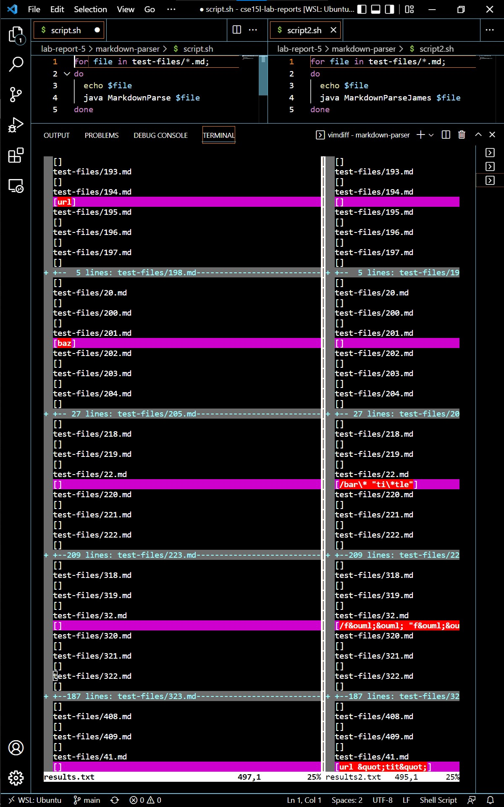
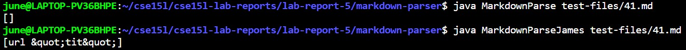
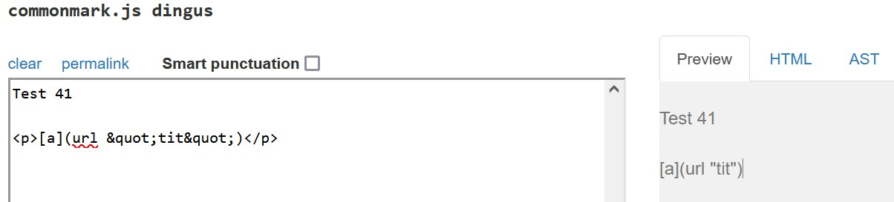
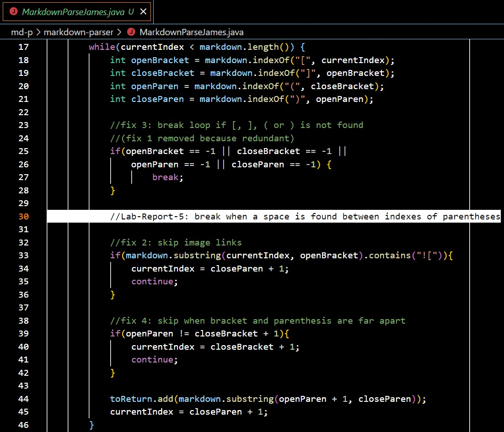
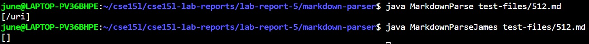
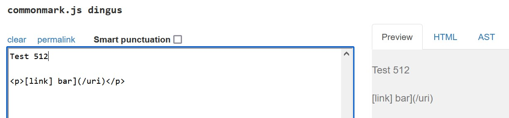
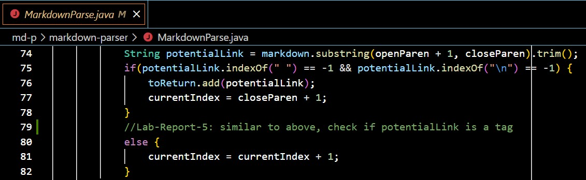

# Lab Report 5 - Week 10

[JL-Young](https://github.com/JL-Young)

Return to [index](https://jl-young.github.io/cse15l-lab-reports/)

---
## Explain:

__How you found the tests with different results (Did you use vimdiff on the results of running a bash for loop? Did you search through manually? Did you use some other programmatic idea?)__

> I used _vimdiff_ to find the tests with different results. First, I added an echo at line 3 in the _script.sh_ file to print out the test names alongside their outputs. Then, I created a second script, _script2.sh_, to run all the tests with my implementation of MarkdownParse, now named _MarkdownParseJames.java_. Next, I recorded the outputs of the two scripts to two .txt files. Lastly, I used vimdiff to display the two files with their differences highlighted.

- Provided [MarkdownParse](https://github.com/nidhidhamnani/markdown-parser.git)

```
bash script.sh > <target file> \\results.txt

vimdiff <file 1> <file 2>

```



__Provide a link to the test-file with different-results (in the provided repository or your repository , either is fine)__

The following test files are from the [provided repository](https://github.com/nidhidhamnani/markdown-parser)

- [test 41 code](https://github.com/nidhidhamnani/markdown-parser/blob/main/test-files/41.html.test); [test 41 download](https://github.com/nidhidhamnani/markdown-parser/blob/main/test-files/41.md)

- [test 512 code](https://github.com/nidhidhamnani/markdown-parser/blob/main/test-files/512.html.test); [test 512 download](https://github.com/nidhidhamnani/markdown-parser/blob/main/test-files/512.md)

---
## For each test:

1. __Describe which implementation is correct, or neither if both give the wrong output__

2. __Indicate both actual outputs (provide screenshots) and also what the expected output is (list the links that are expected in the output).__

3. __Decide on what it should produce (i.e., expected output) by using either VScode preview or the CommonMark demo site.__

4. __For the implementation that’s not correct (or choose one if both are incorrect), describe the bug (the problem in the code) in about 2-3 sentences. You don’t have to provide a fix, but you should be specific about what is wrong with the program, and show the code that should be fixed (Provide a screenshot of code and highlight where the change needs to be made).__

---
### Test 41

> The provided implementation produced the correct output as there should not be any links found in the file. The correct output for file 41.md is an empty list [], whereas my implementation produced [url \&quot;tit\&quot;].

Actual outputs shown in VS Code terminal and expected output shown in [CommonMark](https://spec.commonmark.org/dingus/)





> My implementation of MarkdownParse does not account for irregularities within parentheses of potential links. A link cannot have a space in it so any potential link with a space should be discarded. Although my implementation checks for whether parentheses and brackets exist, it does not check for spaces.



---

### Test 512

> My implementation produced the correct output as there should not be any links found in the file. The correct output for file 512.md is an empty list [], whereas the provided implementation produced [/uri].

Actual outputs shown in VS Code terminal and expected output shown in [CommonMark](https://spec.commonmark.org/dingus/)





> The provided implementation does not account for tags ("\<a>[tag:name]\</a>" displays as "<a>[tag:name]</a>"). Markdown recognizes these as links to the tag page instead of to the "link" written in parentheses afterwards. Although the provided implementation checks for whether potential links have spaces and line breaks, it does not check for angle brackets.

